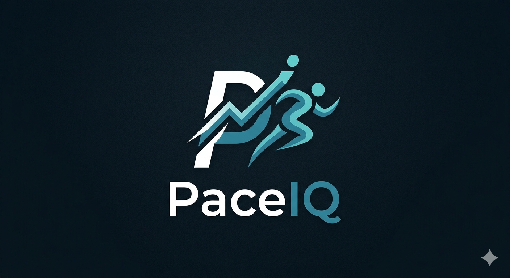

# PaceIQ



**AI Running Coach powered by Notion MCP**

---

## What is PaceIQ?

PaceIQ is an AI running coach that lives in your terminal. It syncs your Strava activities into Notion databases, then uses a LangChain ReAct agent to query your real training data and deliver grounded, data-driven coaching advice.

Ask it anything about your running — weekly mileage trends, injury patterns, race readiness — and it answers with your actual numbers, not generic advice.

## Features

- **Strava Sync** — Automatically imports all your Strava runs into Notion with distance, pace, heart rate, and elevation
- **Weekly Mileage Trends** — Aggregates runs by ISO week to show training load over time
- **Injury Tracking** — Flags injury entries from your training log and correlates them with training patterns
- **Race Readiness** — Analyzes your upcoming races against recent mileage and injury history
- **Daily Logging** — Log sleep, energy, injuries, and notes directly from the CLI
- **Coaching Memory** — Every coaching session is saved to Notion, so the agent remembers past advice and can reference it
- **Data-Grounded Responses** — Every claim is backed by a tool call to your Notion data — no hallucinated stats

## Architecture

```
Strava API ──► src/strava/   ──► Notion Databases ◄── src/notion/
                                       │
                                       ▼
                                 src/agent/
                              (LangChain ReAct)
                                       │
                                       ▼
                                   src/cli.ts
                              (Terminal Interface)
```

| Module | Purpose |
|--------|---------|
| `src/strava/` | OAuth2 token refresh, paginated activity fetching, Notion sync with deduplication |
| `src/notion/` | Notion API client, database schema definitions, setup script for creating 4 databases |
| `src/agent/` | LangChain/LangGraph ReAct agent with 8 tools, system prompt, and streaming responses |

### Notion Databases

| Database | Contents |
|----------|----------|
| **Runs** | Every Strava activity — distance, pace, heart rate, elevation, run type |
| **Training Log** | Daily subjective entries — sleep, energy, injury flags, notes |
| **Races** | Upcoming and past races — date, distance, goal time, status |
| **Coach Sessions** | Persistent coaching history — question, response, tools used, insight type |

## Getting Started

### Prerequisites

- [Node.js](https://nodejs.org/) v18+
- A [Notion](https://www.notion.so/) account with an [integration](https://www.notion.so/my-integrations)
- A [Strava](https://www.strava.com/) account with an [API application](https://www.strava.com/settings/api)
- An [OpenRouter](https://openrouter.ai/) API key

### Setup

1. **Clone the repo**
   ```bash
   git clone https://github.com/<your-username>/PaceIQ.git
   cd PaceIQ
   ```

2. **Install dependencies**
   ```bash
   npm install
   ```

3. **Configure environment variables**
   ```bash
   cp .env.example .env
   ```
   Fill in your API keys in `.env` — see `.env.example` for descriptions of each variable.

4. **Create Notion databases**
   ```bash
   npm run setup
   ```
   This creates 4 databases under your Notion page. Copy the printed database IDs into your `.env` file.

5. **Import Strava data**
   ```bash
   npm run sync
   ```

6. **Start the coach**
   ```bash
   npm start
   ```

### CLI Commands

| Command | Action |
|---------|--------|
| `/sync` | Re-import Strava activities |
| `/history` | View past coaching sessions |
| `/help` | Show example questions |
| `/quit` | Exit PaceIQ |

### Example Questions

```
> How much have I run in the last 4 weeks?
> Am I ready for my upcoming race?
> My knee is sore again — has this happened before?
> Log today: 7hrs sleep, energy high, no injuries
```

## Tech Stack

- **TypeScript** — Strict mode, ES2022, NodeNext modules
- **LangChain / LangGraph** — ReAct agent with tool calling
- **Notion API** — MCP-powered knowledge backend
- **Strava API** — OAuth2 activity sync
- **OpenRouter** — LLM provider (nvidia/nemotron-3-super-120b-a12b)
- **Zod** — Runtime schema validation for tool inputs

## License

[MIT](LICENSE)
