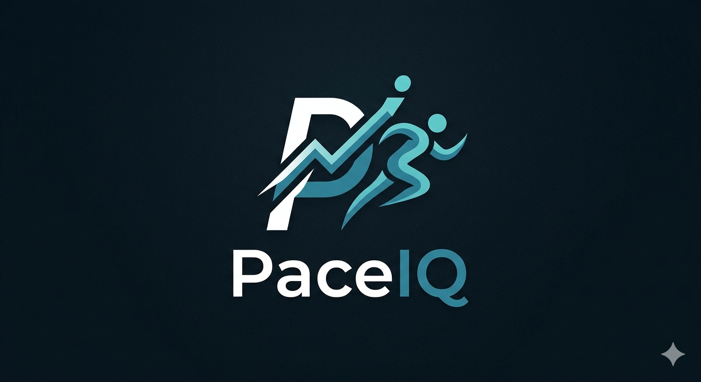

# PaceIQ



**Notion-centered AI running coach backend powered by Notion MCP**

---

## What is PaceIQ?

PaceIQ is a backend service for AI running coaching workflows centered on Notion as the source of truth. It syncs Strava activities into Notion databases, then uses a LangChain ReAct agent to query real training data and deliver grounded, data-driven coaching advice through API endpoints.

You can call PaceIQ from terminal workflows, n8n automations, or webhooks (for example from a Notion button). It is not a bundled web frontend product.

## Features

- **Strava Sync** — Automatically imports all your Strava runs into Notion with distance, pace, heart rate, and elevation
- **Weekly Mileage Trends** — Aggregates runs by ISO week to show training load over time
- **Injury Tracking** — Flags injury entries from your training log and correlates them with training patterns
- **Race Readiness** — Analyzes your upcoming races against recent mileage and injury history
- **Daily Logging** — Log sleep, energy, injuries, and notes directly from the CLI
- **Coaching Memory** — Every coaching session is saved to Notion, so the agent remembers past advice and can reference it
- **Data-Grounded Responses** — Every claim is backed by a tool call to your Notion data — no hallucinated stats
- **Notion Coach Chat** — Ask your AI coach directly from Notion. Type a question in the Coach Chat database, click Ask Coach, and get a response written back in ~15 seconds — no terminal needed. Powered by n8n.

## Architecture

```
Strava API ──► src/strava/ ──► Notion Databases ◄── src/notion/
                                      │
                                      ▼
                                src/agent/
                             (LangChain ReAct)
                                      │
                        ┌─────────────┴─────────────┐
                        ▼                           ▼
                 src/server/server.ts          src/cli.ts
                 (API: /notion-chat,          (Terminal
                  /sync, /health)              interface)
                        │
                        ▼
               n8n / webhooks / Notion button
```

| Module | Purpose |
|--------|---------|
| `src/strava/` | OAuth2 token refresh, paginated activity fetching, Notion sync with deduplication |
| `src/notion/` | Notion API client, database schema definitions, setup script for creating 4 databases |
| `src/agent/` | LangChain/LangGraph ReAct agent with 8 tools, system prompt, and streaming responses |

### Notion Databases

| Database | Contents |
|----------|----------|
| **Runs** | Every Strava activity — distance, pace, heart rate, elevation, run type |
| **Training Log** | Daily subjective entries — sleep, energy, injury flags, notes |
| **Races** | Upcoming and past races — date, distance, goal time, status |
| **Coach Sessions** | Persistent coaching history — question, response, tools used, insight type |

## Getting Started

### Prerequisites

- [Node.js](https://nodejs.org/) v18+
- A [Notion](https://www.notion.so/) workspace where you can create/share pages
- A Notion integration from [my-integrations](https://www.notion.so/my-integrations)
- A [Strava](https://www.strava.com/) API application from [Strava settings](https://www.strava.com/settings/api)
- An [OpenRouter](https://openrouter.ai/) API key

### 1) Install

```bash
git clone https://github.com/<your-username>/PaceIQ.git
cd PaceIQ
npm install
cp .env.example .env
```

### 2) Fill `.env` with required credentials

Update `.env` with at least:

- `NOTION_API_KEY`
- `NOTION_PARENT_PAGE_ID`
- `OPENROUTER_API_KEY`
- `STRAVA_CLIENT_ID`
- `STRAVA_CLIENT_SECRET`
- `STRAVA_REFRESH_TOKEN`

`STRAVA_SYNC_DAYS` defaults to `30` if omitted.

### 3) Run Notion DB setup (one-time)

```bash
npm run setup
```

Expected outcome:

- The script creates **5 databases** under `NOTION_PARENT_PAGE_ID`:
  - PaceIQ Runs
  - PaceIQ Training Log
  - PaceIQ Races
  - PaceIQ Coach Sessions
  - PaceIQ Weekly Reports
- It prints environment variable lines you should copy back into `.env`:
  - `NOTION_RUNS_DB_ID`
  - `NOTION_LOG_DB_ID`
  - `NOTION_RACES_DB_ID`
  - `NOTION_SESSIONS_DB_ID`
  - `NOTION_REPORTS_DB_ID`

### 4) Optional: run a manual sync now

```bash
npm run sync
```

Expected outcome:

- Strava activities from the last `STRAVA_SYNC_DAYS` days are imported to the Runs database.
- Command exits without errors.

### 5) Start PaceIQ API server

```bash
npm start
```

Expected startup outcome:

- App validates Notion schema access.
- App performs a startup sync.
- App prints `PaceIQ running at http://localhost:3000` (or your `PORT`).

### Scripts reference (current)

| Command | What it does |
|---------|---------------|
| `npm run setup` | Creates/prints required Notion DB IDs |
| `npm run sync` | Imports Strava activities into Notion |
| `npm start` | Starts API server and does startup sync/report checks |
| `npm run report` | Generates weekly report workflow |
| `npm run build` | Type-check/compile TypeScript to `dist/` |

### Test `/notion-chat`

After `npm start` is running, use one of these:

Without a secret header (only works if `NOTION_CHAT_SECRET` is unset):

```bash
curl -sS -X POST http://localhost:3000/notion-chat \
  -H 'Content-Type: application/json' \
  -d '{"question":"How much did I run this week?","page_id":"manual-test"}'
```

With secret header (recommended):

```bash
curl -sS -X POST http://localhost:3000/notion-chat \
  -H 'Content-Type: application/json' \
  -H "X-Notion-Chat-Secret: ${NOTION_CHAT_SECRET}" \
  -d '{"question":"How much did I run this week?","page_id":"manual-test"}'
```

Expected outcome:

- HTTP 200 with JSON like `{ "ok": true, "response": "...", "insight_type": "...", "page_id": "manual-test" }`.
- If secret is wrong/missing while server secret is set: HTTP 401.

## Reviewer Quickstart (10 min)

### Copy/paste setup

```bash
git clone https://github.com/<your-username>/PaceIQ.git
cd PaceIQ
npm install
cp .env.example .env
# fill required keys in .env
npm run setup
npm run sync
npm start
```

In a second terminal (from repo root):

```bash
curl -sS http://localhost:3000/health
curl -sS -X POST http://localhost:3000/sync -H 'Content-Type: application/json' -d '{}'
curl -sS -X POST http://localhost:3000/notion-chat \
  -H 'Content-Type: application/json' \
  -H "X-Notion-Chat-Secret: ${NOTION_CHAT_SECRET}" \
  -d '{"question":"Give me a short training check-in.","page_id":"reviewer-quickstart"}'
```

### Verification checklist

- [ ] `npm run setup` created all 5 Notion databases and printed DB IDs.
- [ ] `.env` contains all printed `NOTION_*_DB_ID` values.
- [ ] `npm run sync` completed and runs appear in the **PaceIQ Runs** DB.
- [ ] `GET /health` returns `{ "ok": true, "service": "paceiq-server" }`.
- [ ] `POST /sync` returns `{ "success": true, "message": "Sync complete" }`.
- [ ] `POST /notion-chat` returns `{ "ok": true, ... }` with a coach response.
- [ ] If `NOTION_CHAT_SECRET` is set, missing/incorrect header correctly returns 401.

## Tech Stack

- **TypeScript** — Strict mode, ES2022, NodeNext modules
- **LangChain / LangGraph** — ReAct agent with tool calling
- **Notion API** — MCP-powered knowledge backend
- **Strava API** — OAuth2 activity sync
- **OpenRouter** — LLM provider (stepfun/step-3.5-flash:free)
- **Zod** — Runtime schema validation for tool inputs

## License

[MIT](LICENSE)
